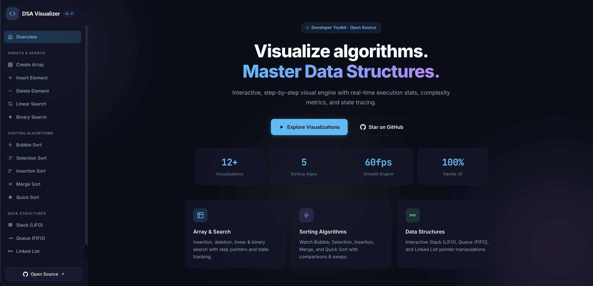
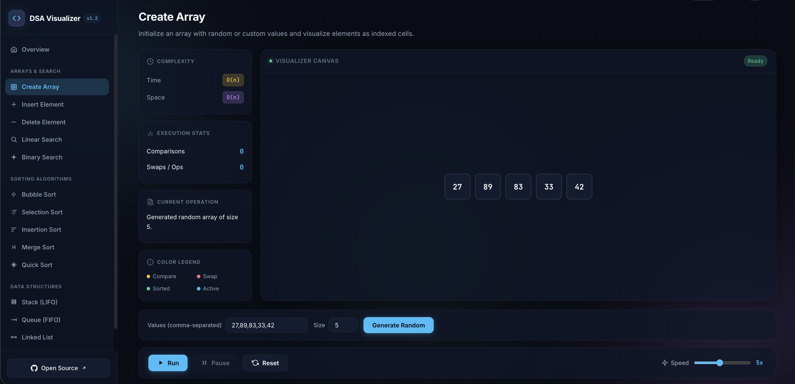
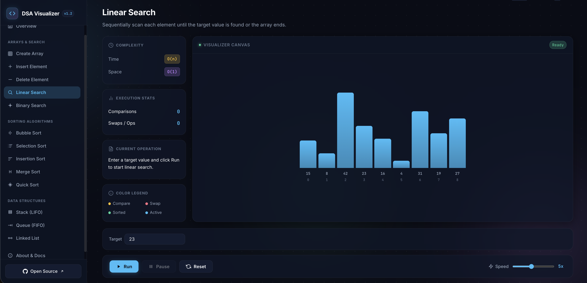
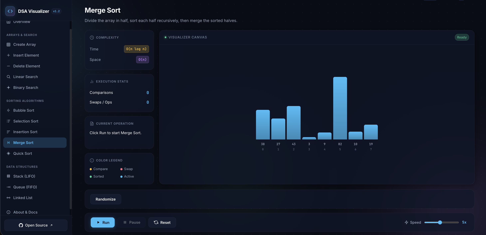
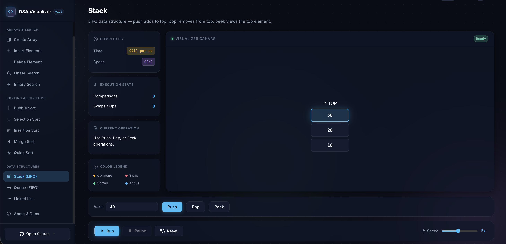
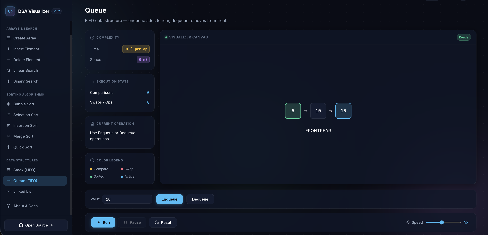
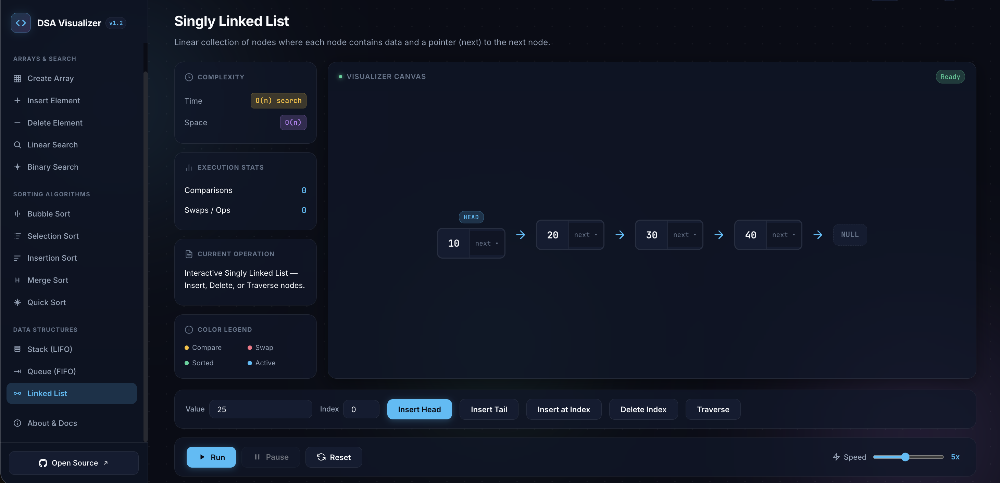

# ⚡ DSA Visualizer — Interactive Data Structures & Algorithms Visualizer

[](LICENSE)
[](https://developer.mozilla.org/en-US/docs/Web/JavaScript)
[](https://developer.mozilla.org/en-US/docs/Web/CSS)
[](#features)

> An interactive Data Structures and Algorithms visualizer built using Vanilla HTML, CSS, and JavaScript. Designed to help students understand algorithms through animations, step-by-step execution, and visual representation.

---

# 📸 Demo & Screenshots

Example:

Homepage:



Array:



Searching:



Sorting:



Stack:



Queue:



Linked List:



---

# ✨ Features

## 🎨 Modern UI
- Clean developer-focused dark theme
- Responsive layout
- Smooth animations
- Interactive visualization workspace
- Real-time status updates

## 📊 Implemented Algorithms & Data Structures

### Arrays
- Create Array
- Insert Element
- Delete Element
- Linear Search
- Binary Search

### Sorting Algorithms
- Bubble Sort
- Selection Sort
- Insertion Sort

### Data Structures
- Stack (LIFO)
- Queue (FIFO)
- Singly Linked List

---

# ⚡ Visualization Features

- Run algorithm animations
- Pause and resume execution
- Reset visualization
- Adjustable animation speed
- Step-by-step operation explanations
- Live comparison tracking
- Swap counters

---

# 📚 Learning Information

For each algorithm, the visualizer provides:

- Algorithm explanation
- Time complexity
- Space complexity
- Current execution step

Example:

```
Comparing index 2 and index 3

Current Operation:
Swap elements

Comparisons: 5
Swaps: 2
```

---

# 🛠️ Tech Stack

- HTML5
- CSS3
- JavaScript (ES6+)
- DOM Manipulation
- CSS Animations

No frameworks.  
No external dependencies.  
Built completely using native web technologies.

---

# 📁 Project Structure

```
DSA-Visualizer/
│
├── index.html        # Main HTML structure
├── style.css         # Styling and animations
├── script.js         # Algorithms and visualization logic
└── README.md         # Documentation
```

---

# 🚀 Installation & Local Setup

Clone this repository:

```bash
git clone https://github.com/rudreshkumbhare25-dev/DSA-Visualizer.git
```

Navigate into the project:

```bash
cd DSA-Visualizer
```

Open:

```
index.html
```

in your browser.

For the best experience, use VS Code Live Server.

---

# 📊 Complexity Reference

| Algorithm | Best Case | Average Case | Worst Case | Space |
|---|---|---|---|---|
| Linear Search | O(1) | O(n) | O(n) | O(1) |
| Binary Search | O(1) | O(log n) | O(log n) | O(1) |
| Bubble Sort | O(n) | O(n²) | O(n²) | O(1) |
| Selection Sort | O(n²) | O(n²) | O(n²) | O(1) |
| Insertion Sort | O(n) | O(n²) | O(n²) | O(1) |
| Stack Operations | O(1) | O(1) | O(1) | O(n) |
| Queue Operations | O(1) | O(1) | O(1) | O(n) |
| Linked List Operations | O(1) | O(n) | O(n) | O(n) |

---

# 🔮 Future Improvements

Planned features:

- Merge Sort visualization
- Quick Sort visualization
- Binary Search Tree visualization
- Graph algorithms
  - BFS
  - DFS
  - Dijkstra's Algorithm
- Algorithm comparison mode
- Custom user input structures
- More advanced animations

---

# 📜 License

Distributed under the MIT License.
